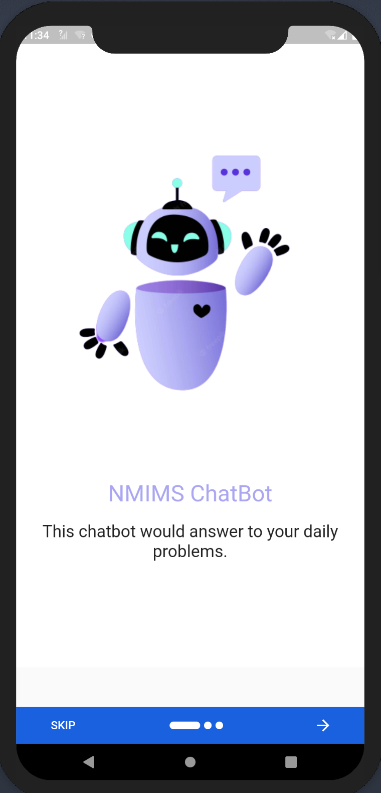
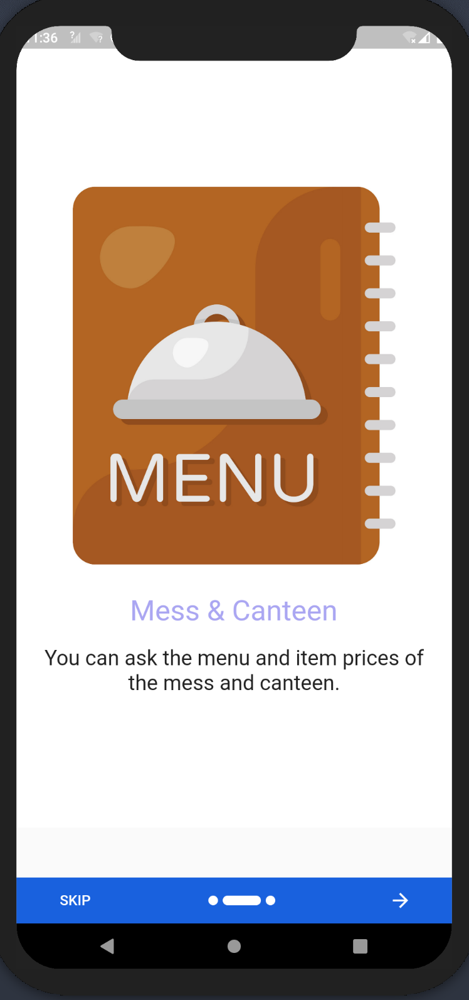
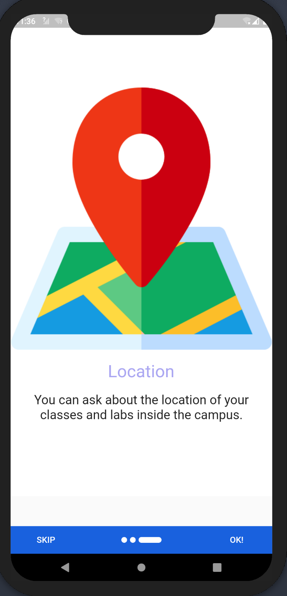

## NMChat

*This application is developed to solve some common problems that were faced by the students of NMIMS University, Shirpur.*

<p>



</p>

---

### Description
***Problems:*** A common problem faced by me as a student of SVKM'S NMIMS, Shirpur is that it is difficult to remember the classroom locations with thier different names. Some computer labs or classrooms have more than one names which causes confusion that where is the location of classroom and labs.
Another problem is that if classes goes to long so that we have very less time to decide what to eat in the canteen, or what we will going to get in today's lunch or dinner so that we can plan our meal for this we need menu.

***Solutions:*** The most challenging problem to get the location of classroom and labs got solved using the **Cloud SQL**. This helped me to run a query into the complete database of location and also services like **Cloud Function** helped to make the connectivity as an API provider.
The canteen menu is also fetched using the fixed database using **Cloud SQL**.
All the databases are stored into **Google Cloud Storage** as csv format then imported into the **SQL instance**

---

### Files
- [main.dart](./lib/main.dart)
``` home: const OnBoarding(),```

On opening the app it will first display the Onboarding screen to show what functionalities this app offers to us.
this onboarding page is present at [OnBoarding.dart](./lib/OnBoarding/OnBoarding.dart).

- [Ask.dart](./lib/Ask/Ask.dart)

This page ask for the unique id that are given to the students to validate if he/she is a member of this university.
As this data is confidential to the university i used a demo screen which takes a fix 11 digit number to navigate to main page.

- [Home.dart](./lib/HomePage/HomePage.dart)

This file consist of various methods, widgets and much more that are used to build the entire working of this chatbot application.

---

### Special Thanks
- [GDSC India]()
- [GDSC MPSTME Shirpur]()

Thanks!! for giving me this opportunity to solve a common problem of my college. And to represent my college on a global level as Google Cloud Career Practitioners Campaign Facilitator.